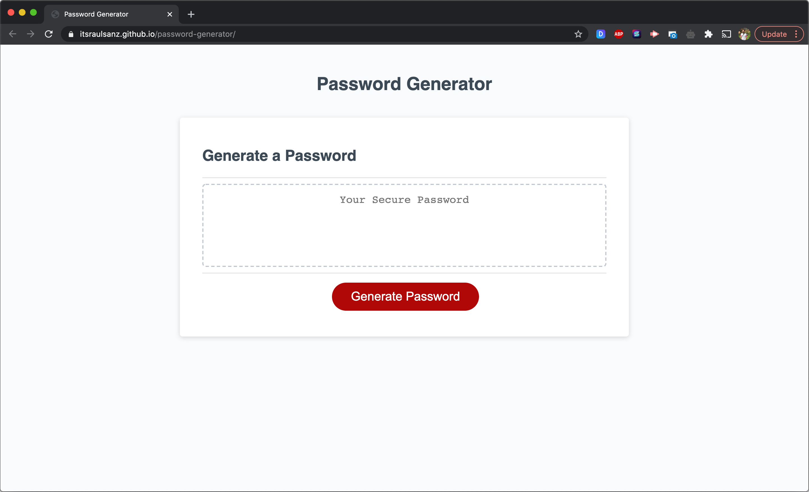

# Password Generator

## Description

This repository contains a modified starter code to create an application to generate random passwords based on the criteria selected.


## Mockup


## Pseudo Code

```
User clicks the button
  Prompt 1: enter the password length between 8 and 128 characters
    If you select a lower or a higher number of characters, an error will appear
  Prompt 2: do you want lowercase?
  Prompt 3: do you want uppercase?
  Prompt 4: do you want numbers?
  Prompt 5: do you want special characters?
  If at least one character type isn't selected, it will appear an alert
  The input will be validated and create a prepassword
  A random password is generated that matches the selected criteria
```

## Deployed Application

Website URL: <a href="https://itsraulsanz.github.io/password-generator/">https://itsraulsanz.github.io/password-generator/</a>

